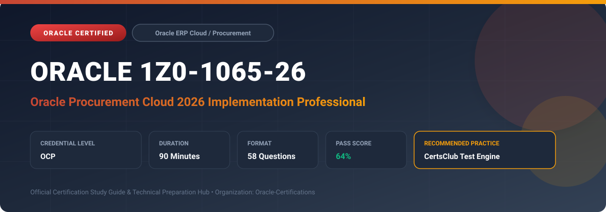

  

# Oracle 1Z0-1065-26: Oracle Procurement Cloud 2026 Implementation Professional

---

## 1. Exam Overview & Candidate Profile

The **Oracle 1Z0-1065-26: Oracle Procurement Cloud 2026 Implementation Professional** examination is designed for cloud professionals, enterprise architects, implementation consultants, and systems administrators who demonstrate deep practical knowledge and operational competence in deploying, configuring, and optimizing Oracle technologies.

The Oracle Procurement Cloud 2026 Implementation Professional (1Z0-1065-26) exam validates implementation skills for the 2026 release of Oracle Procurement Cloud. Candidates demonstrate mastery of touchless automated purchasing, AI-assisted requisitioning in Redwood UX, real-time supplier risk assessment, complex negotiation award rules in Sourcing, and automated contract authoring.

### Target Audience & Prerequisites
- **Target Roles**: Implementation Consultants, Cloud Solution Architects, DevOps/SysOps Engineers, and Enterprise Functional Analysts.
- **Recommended Experience**: 1–2 years of hands-on experience in configuring, administering, or implementing the relevant Oracle solutions.
- **Credential Earned**: Oracle Certified Professional (OCP).

---

## 2. Key Exam Specifications

| Specification | Details |
| :--- | :--- |
| **Exam Code** | **Oracle 1Z0-1065-26** |
| **Official Title** | Oracle Procurement Cloud 2026 Implementation Professional |
| **Certification Track** | Oracle ERP Cloud / Procurement |
| **Exam Duration** | 90 Minutes |
| **Number of Questions** | 58 Questions |
| **Passing Score** | 64% |
| **Question Format** | Multiple Choice (Single/Multiple Answer), Scenario-Based Questions |
| **Delivery Provider** | Oracle University / Pearson VUE (Online Proctored or Test Center) |
| **Recommended Practice Engine** | [CertsClub Oracle Practice Tests](https://www.certsclub.com/oracle/1z0-1065-26-dumps.html) |

---

## 3. Official Blueprint & Exam Domain Breakdown

The examination assesses candidate competencies across core functional domains weighted as follows:

| Domain Area | Weighting |
| :--- | :--- |
| **2026 Procurement Framework & BU Structures** | `15%` |
| **Automated Purchasing & Touchless Order Processing** | `25%` |
| **Redwood Self-Service Requisitioning & Smart Buying** | `20%` |
| **Supplier Intelligence, Onboarding, & Risk (SQM)** | `20%` |
| **Advanced Sourcing & Enterprise Contract Lifecycle** | `20%` |

---

## 4. Deep Dive into Complex & Challenging Technical Topics

To secure a passing score on the 1Z0-1065-26 exam, candidates must master the following advanced concepts:

- Configuring touchless purchase order creation rules based on blanket purchase agreements and smart sourcing rules.
- Implementing Redwood Shopping experiences with guided learning and AI search auto-suggestions.
- Designing complex multi-attribute scoring models and supplier tier ranking in Oracle Sourcing.
- Managing electronic signatures and contract deviation approvals with Oracle Contracts integration.

---

## 5. Scenario-Based Demo & Practice Questions

### Question 1
What condition must be met for a requisition in Oracle Procurement Cloud 2026 to automatically convert into a Purchase Order without manual buyer intervention (touchless processing)?

A) The requisition must be created by a system administrator
B) The requisition lines must reference a valid approved Blanket Purchase Agreement (BPA) or Contract Purchase Agreement (CPA) with automatic ordering enabled
C) The requisition amount must exceed $100,000
D) The requisition must contain only non-catalog items

- **Correct Answer**: `B) The requisition lines must reference a valid approved Blanket Purchase Agreement (BPA) or Contract Purchase Agreement (CPA) with automatic ordering enabled`
- **Technical Explanation**: Touchless PO conversion requires that the approved requisition line points to a negotiated agreement (BPA/CPA), the supplier is active, and the 'Automatically generate orders' flag is configured.

---

### Question 2
In Oracle Sourcing 2026, which capability allows buyers to evaluate supplier bids based on non-price factors such as sustainability ratings, lead time, and warranty terms?

A) Multi-Attribute Scoring and Cost Factors
B) Standard Line Item Pricing
C) Fixed Bid Auctioning
D) Payment Terms Discounting

- **Correct Answer**: `A) Multi-Attribute Scoring and Cost Factors`
- **Technical Explanation**: Multi-Attribute Scoring allows sourcing teams to assign weighted scoring to subjective and objective non-price requirements alongside price, calculating an overall composite score for each bid.

---

## 6. Recommended Preparation Strategy & Practice Testing Engine

Achieving certification in **Oracle 1Z0-1065-26** requires balanced theoretical study and scenario-based simulation practice:

1. **Review Oracle Documentation**: Master architecture guides, implementation workbooks, and administration manuals on the Oracle Help Center.
2. **Hands-on Lab Practice**: Execute real-world configuration, policy setup, and troubleshooting tasks in your cloud tenancy or test instance.
3. **Simulated Exam Drills**: Practice answering timed, scenario-based multiple-choice questions to familiarize yourself with the question formats, traps, and timing constraints.

### Practice With CertsClub
For realistic practice questions, updated dumps, and mock testing environments:
- **Resource**: [CertsClub Oracle Practice Test Engine](https://www.certsclub.com/oracle/1z0-1065-26-dumps.html)
- **Special Discount**: Use coupon code **`club20`** during checkout for an instant **20% discount** on all practice exam bundles and testing engines.

---

## 7. Official Documentation & References

- [Oracle University Certification Registry](https://education.oracle.com/)
- [Oracle Help Center Documentation Portal](https://docs.oracle.com/)
- [Oracle Cloud Infrastructure & Applications Guides](https://docs.oracle.com/en/cloud/)
- [CertsClub Oracle Certification Exam Practice](https://www.certsclub.com/oracle/1z0-1065-26-dumps.html)

---

## 8. SEO & Discovery Keywords

`oracle 1z0-1065-26`, `oracle 1z0-1065-26 exam`, `oracle 1z0-1065-26 dumps`, `1Z0-1065-26 practice questions`, `1Z0-1065-26 study guide`, `oracle 1z0-1065-26 syllabus`, `oracle procurement cloud 2026 implementation professional`, `certsclub 1z0-1065-26`